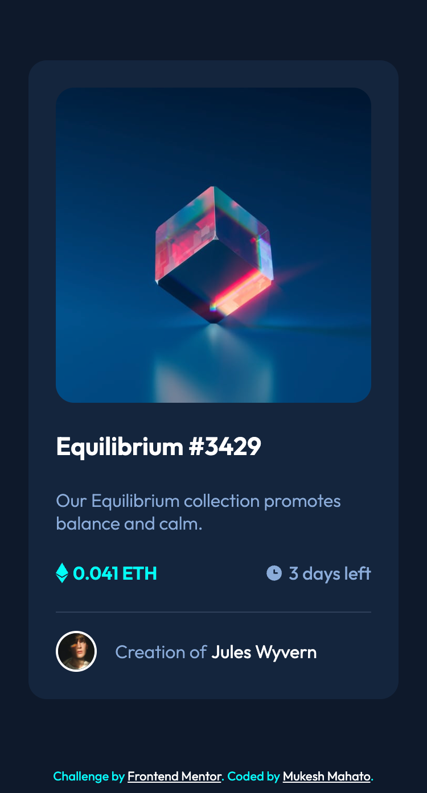

# NFT preview card component solution

## Table of content
- [Overview](#Overview)
- [Screenshot](#Screenshot)
- [Links](#links)
- [Build With](#Build-with)
- [Author](#author)

## Overview

This is a solution to the [NFT preview card component challenge on Frontend Mentor](https://www.frontendmentor.io/challenges/nft-preview-card-component-SbdUL_w0U). Frontend Mentor challenges help you improve your coding skills by building realistic projects. 

## Screenshot

#### Desktop Design

#### Mobile Design

## Links

- Solution URL: [Click Here](https://www.frontendmentor.io/solutions/nft-preview-card-component-using-html-and-css-owVJujYs59)
- Live Site URL: [Click Here](https://iammukeshmahato.github.io/nft-preview-card-component)

## ⚙ Built with

- HTML
- CSS
- Flexbox

## Author

- Website - [myselfmukesh.blogspot.com](https://myselfmukesh.blogspot.com/)
- Frontend Mentor - [@mukeshmahato843](https://www.frontendmentor.io/profile/mukeshmahato843)
- Twitter - [@mukeshmahato843](https://www.twitter.com/mukeshmahato843)
- Facebook - [@iammukeshmahato](https://www.facebook.com/iammukeshmahato)
- Messenger - [Direct Message](https://m.me/iammukeshmahato)
